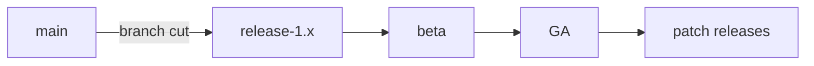

This page is a reference while writing. Every block below is produced by a
shortcode, a render hook or front matter. There is no custom HTML in the post.

## Tutorial front matter

`difficulty`, `duration` and `prerequisites` render the strip under the title.
`series` plus `weight` add the "Part N of M" box and the next/previous links at
the bottom. `topics` takes one or two of: `containers-linux`, `kubernetes`,
`ai-infra`, `open-source`.

## Margin notes

Plain Markdown footnotes become margin notes on wide screens.[^margin] On
narrower screens they stay at the bottom of the page as usual.[^second]

[^margin]: Like this one. It sits in the left margin, level with the paragraph that refers to it.
[^second]: Several notes on one paragraph stack instead of overlapping.

## Callouts


A plain note. Use it for context the reader can skip.



Run `hugo server -D --navigateToChanged` and the browser jumps to the file you edit.



Updates reboot the node. Drain it first with `kubectl drain`.



`wipefs -a` erases the partition table. Double-check the device name.


## Steps

{}

### Check the running version

```sh
cat /etc/os-release
```

### Ask update_engine for its status

```sh {filename="check-update.sh"}
update_engine_client -status
```

### Reboot into the new version

Once the status says `UPDATE_STATUS_UPDATED_NEED_REBOOT`, reboot.

{}

## Tabs

Tabs that share a `group` switch together, and the choice is remembered.



```sh
sudo systemctl restart update-engine
```


```sh
sudo apt update && sudo apt upgrade
```





Flatcar has no package manager, so the OS updates as a single image.


Ubuntu updates package by package.



## Diagrams



## Terminal recordings



## Live widgets


Flatcar keeps two `/usr` partitions. Updates go to the one not in use, and
the bootloader falls back if the new version fails to boot.

